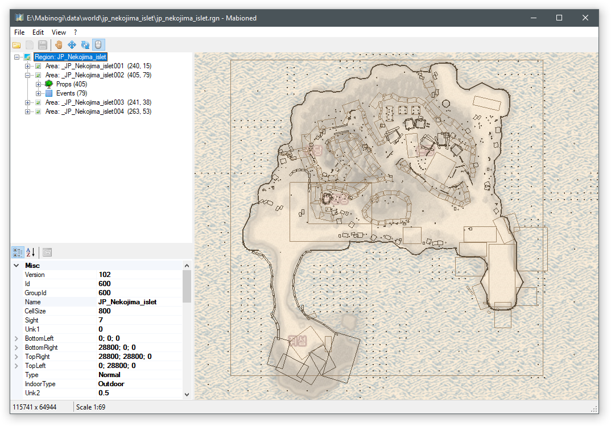

Mabioned
=============================================================================

Mabioned is an editor for Mabinogi's Region (.rgn) and Area (.area) file
formats. It allows you to change any part of the files in a clean
interface, while providing some quality-of-life features, like moving
and rotating entities with the mouse on a map.

For the moment Mabioned renders the region only as a 2D map. This works
very well to get an overview and move entities, but there are limits.
Modifying the terrain for example is possible, but needs to be done
by modifying the respective objects' properties by hand.

For more information about the program and the game's files that this editor
modifies refer to the files in the Documentation folder. Binary templates
for the file formats can be found in [this repository](https://github.com/exectails/MabinogiFileFormats).
If you encounter any bugs or errors, please create an issue so they
can be fixed.

If you'd like to help with the development or have suggestions on how
to improve the program I'd be happy to review your contributions,
simply create an issue for each one.

Planned Features
-----------------------------------------------------------------------------

- Undo and Redo options
- Generating variation XML files for dynamic regions
- Importing and exporting heightmaps
- Creating new regions
- 3D preview and possibly editing

Preview
-----------------------------------------------------------------------------

Links
-----------------------------------------------------------------------------

- GitHub: https://github.com/exectails/Mabioned
- Forum: https://nocodenolife.org/forum/topic/550-mabioned-2d-region-editor/
